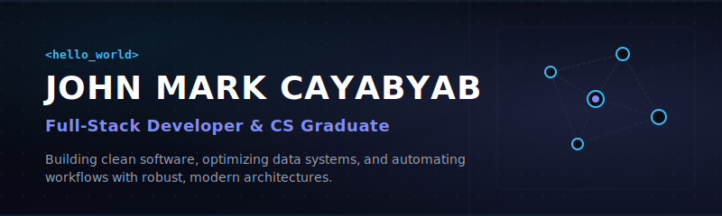
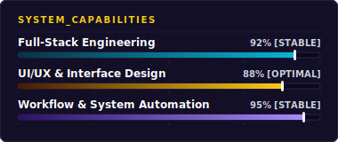
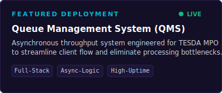

  

<h1 align="center">Hi there, I'm John Mark 👋</h1>

  <strong>Full-Stack Developer • UI/UX Designer • Systems Builder • CS Graduate</strong>

  I design and build software from the database up to the user interface. I love taking complex requirements and translating them into clean, practical tools that automate work and make operations smoother.

<table width="100%">
  <!-- Row 1: Intro Bento Card -->
  <tr>
    <td colspan="2" valign="top">
      <h3>👋 About Me</h3>
      

        I'm a Computer Science graduate from <strong>Taguig City University</strong>. I enjoy combining full-stack development with a strong eye for UI/UX design to build functional systems. Whether it is deploying live queues for government agencies or building automation tools, I focus on performance, usability, and clean structure.
      

    </td>
  </tr>
  <!-- Row 2: What I Do & Highlights -->
  <tr>
    <!-- What I Do Card -->
    <td width="55%" valign="top">
      <h3>🚀 What I Do</h3>
      <ul>
        <li><strong>Full-Stack Development:</strong> Building clean web applications using modular architectures.</li>
        <li><strong>UI/UX Design:</strong> Designing intuitive, modern user interfaces that are accessible and pleasant to navigate.</li>
        <li><strong>Automation &amp; Ops:</strong> Streamlining business logic, automating report creation, and optimizing database performance.</li>
        <li><strong>Systems Support:</strong> Resolving hardware faults, configuring subnets, and deploying software under high-uptime requirements.</li>
      </ul>
    </td>
    <!-- Highlights Card -->
    <td width="45%" valign="top">
      <h3>🏆 Highlights</h3>
      <ul>
        <li>🎓 <strong>CS Graduate</strong> ('26, TCU) — Cumulative GWA: 1.65.</li>
        <li>🥇 <strong>1st Place</strong> CICT 2026 Research Festival (Principal Investigator) for optimizing operational data.</li>
        <li>💼 Engineered &amp; deployed a live, asynchronous <strong>Queue Management System (QMS)</strong> for TESDA.</li>
        <li>🥈 <strong>1st Runner-Up</strong> TCU Systems Fair Competition.</li>
      </ul>
    </td>
  </tr>
  <!-- Row 3: Tech Toolbox & Connect -->
  <tr>
    <!-- Toolbox Card -->
    <td valign="top">
      <h3>🛠️ Tech Toolbox</h3>
      
<strong>Languages &amp; Databases:</strong>

      

        
        
        
        
        
      

      
<strong>Tools &amp; Setup:</strong>

      

        
        
        
        
      

    </td>
    <!-- Connect Card -->
    <td valign="top">
      <h3>📫 Let's Connect</h3>
      
Feel free to reach out if you want to collaborate, talk about design systems, or discuss automation!

      <ul>
        <li>📧 <strong>Email:</strong> <a href="mailto:jcayabyab655@gmail.com">jcayabyab655@gmail.com</a></li>
        <li>💼 <strong>GitHub:</strong> <a href="https://github.com/Tofuwho">github.com/Tofuwho</a></li>
        <li>📍 <strong>Location:</strong> Parañaque City, NCR, Philippines</li>
      </ul>
    </td>
  </tr>
</table>

<h3 align="center">📊 Profile Showcases</h3>

  
  

