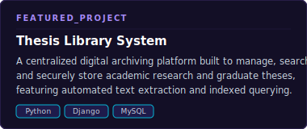

  

<h1 align="center">Hi there, I'm John Mark 👋</h1>

  <strong>Full-Stack Engineer • Systems Architect • UI/UX Designer</strong>

  I design and build software systems from the database up to the interface. I focus on translating complex workflow requirements into high-performance, automated applications with clean structure and robust reliability.

<!-- Promoted Tech Stack (Second Section) -->
<h3 align="center">🛠️ Technical Stack &amp; Systems Architecture</h3>

<table width="100%">
  <tr>
    <td width="25%" valign="top"><strong>Languages &amp; Core</strong></td>
    <td width="75%">
      
      
      
      
    </td>
  </tr>
  <tr>
    <td valign="top"><strong>Frameworks &amp; Runtimes</strong></td>
    <td>
      
      
      
    </td>
  </tr>
  <tr>
    <td valign="top"><strong>Data &amp; Operations</strong></td>
    <td>
      
      
      
      
      
    </td>
  </tr>
  <tr>
    <td valign="top"><strong>Systems &amp; Libraries</strong></td>
    <td>
      <code>Asynchronous Queuing</code> &bull; <code>RapidFuzz String Matching</code> &bull; <code>PyMuPDF Document Analysis</code> &bull; <code>Hardware Audits</code> &bull; <code>Network Routing</code>
    </td>
  </tr>
</table>

<table width="100%">
  <!-- Row 1: Profile Brief -->
  <tr>
    <td colspan="2" valign="top">
      <h3>👋 Biography</h3>
      

        I'm a Computer Science graduate from <strong>Taguig City University</strong> (Cumulative GWA: 1.65). I combine solid backend development patterns with a refined UI/UX design perspective to engineer production-ready systems. From deploying live, asynchronous queuing engines for government facilities to building automated administrative tools, I build software that reduces friction, automates operations, and maintains high uptime.
      

    </td>
  </tr>
  <!-- Row 2: Core Focus & Highlights -->
  <tr>
    <!-- What I Do -->
    <td width="50%" valign="top">
      <h3>⚡ Core Focus Areas</h3>
      <ul>
        <li><strong>Full-Stack Engineering:</strong> Building modular web applications, designing efficient database schemas, and developing clean APIs.</li>
        <li><strong>Systems &amp; Automation:</strong> Writing background scripts, automating operational reports, and integrating hardware/network infrastructure.</li>
        <li><strong>UI/UX Architecture:</strong> Designing accessible, highly interactive interfaces with user-friendly layouts and smooth micro-interactions.</li>
        <li><strong>Operational Support:</strong> Auditing server performance, optimizing SQL queries, and deploying live applications under strict service targets.</li>
      </ul>
    </td>
    <!-- Highlights -->
    <td width="50%" valign="top">
      <h3>🏆 Key Achievements</h3>
      <ul>
        <li><strong>1st Place</strong> — CICT 2026 Research Festival (Principal Investigator) for advanced operational data optimization.</li>
        <li><strong>1st Runner-Up</strong> — TCU Systems Fair Competition for high-performance software projects.</li>
        <li><strong>Deployed Queue Management System (QMS)</strong> — Engineered a live, asynchronous ticketing and throughput tracker for TESDA MPO.</li>
      </ul>
    </td>
  </tr>
  <!-- Row 3: Connect -->
  <tr>
    <td colspan="2" valign="top">
      <h3>📫 Connection Gateway</h3>
      
Feel free to reach out to collaborate on systems engineering, discuss dashboard designs, or talk automation:

      <ul>
        <li>📧 <strong>Email:</strong> <a href="mailto:jcayabyab655@gmail.com">jcayabyab655@gmail.com</a></li>
        <li>💼 <strong>GitHub:</strong> <a href="https://github.com/Tofuwho">github.com/Tofuwho</a></li>
        <li>📍 <strong>Location:</strong> NCR, Philippines</li>
      </ul>
    </td>
  </tr>
</table>

<h3 align="center">📊 Profile Showcases</h3>

  

  
  

<h3 align="center">🐍 Contribution Snake</h3>

  <picture>
    <source media="(prefers-color-scheme: dark)" srcset="https://raw.githubusercontent.com/Tofuwho/Tofuwho/output/github-snake-dark.svg" />
    <source media="(prefers-color-scheme: light)" srcset="https://raw.githubusercontent.com/Tofuwho/Tofuwho/output/github-snake.svg" />
    
  </picture>

