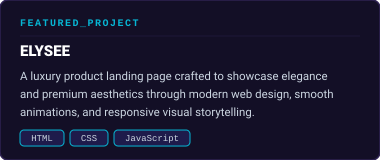
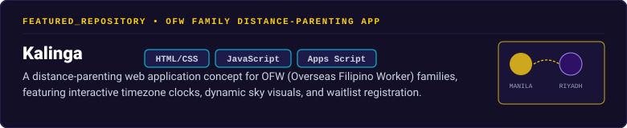
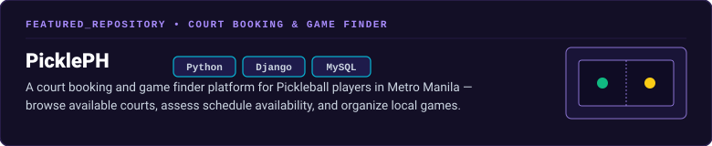
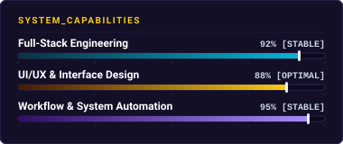

  

  &nbsp;
  &nbsp;
  

  <em>CS Graduate (GWA 1.65) · Full-Stack Developer with production deployment experience in a live government office. 
  Building automated systems, clean web apps, and AI-integrated workflows.</em>

---

<!-- ═══════════════════ TECH STACK ═══════════════════ -->
<h3 align="center">⚡ Technical Stack</h3>

  

  <code>REST APIs</code> · <code>LLM Integration</code> · <code>Agentic Workflows</code> · <code>Prompt Engineering</code> · <code>RapidFuzz</code> · <code>PyMuPDF</code> · <code>CI/CD (GitHub Actions)</code> · <code>git-flow</code>

---

<!-- ═══════════════════ FEATURED REPOSITORIES ═══════════════════ -->
<h3 align="center">🚀 Featured Repositories</h3>

  

  

  

---

<!-- ═══════════════════ WHAT I OFFER ═══════════════════ -->

<table>
  <tr>
    <td width="50%" valign="top">
      <h3>💼 What I Bring to the Table</h3>
      <ul>
        <li><strong>Production-Tested Developer</strong> — Built and deployed systems used daily at a live government office (TESDA), not just academic projects.</li>
        <li><strong>Full-Stack Builder</strong> — Design databases, write backend logic, build APIs, and ship polished front-ends with clean UI/UX.</li>
        <li><strong>AI-Ready Engineer</strong> — Hands-on LLM integration, agentic workflows, prompt engineering, and automated ML pipeline construction.</li>
        <li><strong>Independent Operator</strong> — Thrive under minimal supervision; translate institutional requirements into production-ready software autonomously.</li>
        <li><strong>Award-Winning Researcher</strong> — 1st Place (Grand Champion) at the CICT 2026 University Research Festival as Principal Investigator.</li>
      </ul>
    </td>
    <td width="50%" valign="top">
      <h3>🏆 Key Highlights</h3>
      <ul>
        <li><strong>Grand Champion</strong> — CICT 2026 Research Festival (Principal Investigator) for operational data optimization research.</li>
        <li><strong>1st Runner-Up</strong> — TCU Systems Fair for high-performance software project.</li>
        <li><strong>Deployed Queue Management System</strong> — Real-time, asynchronous QMS for TESDA replacing a manual paper process.</li>
        <li><strong>Procurement Ledger System</strong> — Automated government document generation (RIS, PR, PO, PPMP, APP-CSE).</li>
        <li><strong>267+ commits</strong> — On ThesisLibrary project with full CI/CD pipeline and git-flow workflow.</li>
        <li><strong>Hybrid Search Engine</strong> — 3-layer algorithm: weighted metadata + full-text PDF scanning + fuzzy correction.</li>
      </ul>
    </td>
  </tr>
</table>

---

<!-- ═══════════════════ EXPERIENCE ═══════════════════ -->

<h3>📋 Experience & Education (click to expand)</h3>

 

#### 🏢 OJT IT Engineer & Full-Stack Developer — TESDA Muntiparlastapat District Office
*Feb 2026 – May 2026*

- Built and deployed a **real-time Queue Management System** from scratch, replacing manual paper-based queuing at a live government service office.
- Developed a **Procurement Ledger System** managing fiscal year budget data with automated generation of RIS, PR, PO, PPMP, and APP-CSE government documents.
- Diagnosed hardware faults under high-uptime constraints; configured network printer subnet routing.
- Operated independently under minimal supervision, translating institutional requirements into production systems.

#### 🎓 B.S. Computer Science — Taguig City University
*Graduated June 2026 · GWA: 1.65 · Final Term GPA: 1.53*

- **Grand Champion** — CICT 2026 University Research Festival
- **1st Runner-Up** — TCU Institutional Systems Fair
- Selected Presenter, 2nd Annual University Research Symposium
- **Relevant Coursework:** Scalable Systems Design, Software Engineering, Applied AI/ML, Full-Stack Architectures, Agentic Workflows

#### 🤖 AI & Agentic Workflow Exposure
*2025 – 2026*

- Designed multi-step agentic workflows using LLM APIs with structured prompt engineering.
- Built automated ML pipelines integrating LLM agents as reasoning layers within application workflows.
- Applied AI/ML concepts to practical automation problems in OJT and academic projects.

---

<!-- ═══════════════════ CAPABILITIES ═══════════════════ -->
<h3 align="center">📊 System Capabilities</h3>

  

---

<!-- ═══════════════════ GITHUB STATS ═══════════════════ -->
<h3 align="center">📈 GitHub Analytics</h3>

  
  

  

---

<!-- ═══════════════════ CONTRIBUTION SNAKE ═══════════════════ -->
<h3 align="center">🐍 Contribution Activity</h3>

  <picture>
    <source media="(prefers-color-scheme: dark)" srcset="https://raw.githubusercontent.com/Tofuwho/Tofuwho/output/github-snake-dark.svg" />
    <source media="(prefers-color-scheme: light)" srcset="https://raw.githubusercontent.com/Tofuwho/Tofuwho/output/github-snake.svg" />
    
  </picture>

---

  🔧 Actively seeking <strong>Junior Software Engineer</strong>, <strong>Full-Stack Developer</strong>, or <strong>AI/Automation</strong> roles. Let's build something great together.

  

